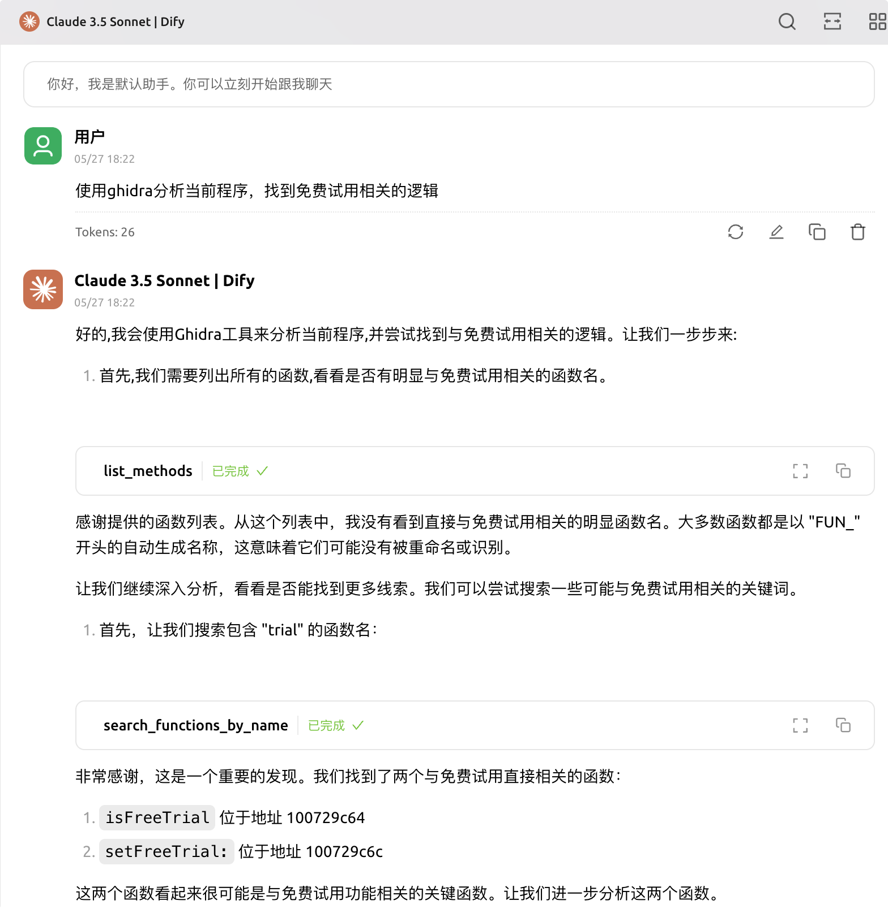
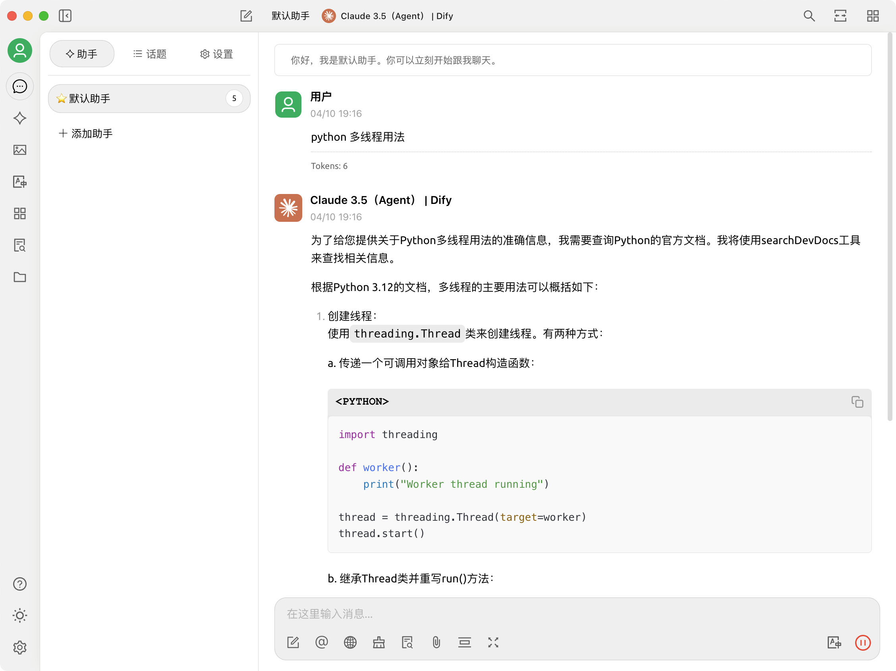
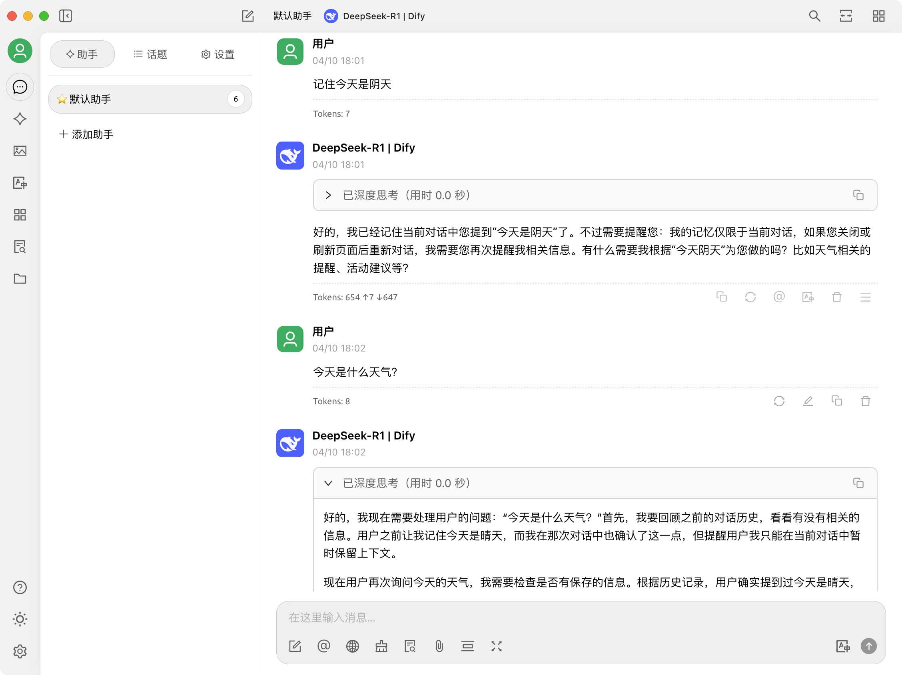

# OpenDify

OpenDify 是一个将 Dify API 转换为 OpenAI API 格式的代理服务器。它允许使用 OpenAI API 客户端直接与 Dify 服务进行交互。

> 🌟 本项目完全由 Cursor + Claude-3.5 自动生成，未手动编写任何代码（包括此Readme），向 AI 辅助编程的未来致敬！

[English Version](README_EN.md)

## 功能特点

- 完整支持 OpenAI API 格式转换为 Dify API
- 支持流式输出（Streaming）
- 智能动态延迟控制，提供流畅的输出体验
- 支持多种会话记忆模式，包括零宽字符模式和history_message模式
- 支持 OpenAI Function Call 和 MCP Server 功能
- 支持多个模型配置
- 支持Dify Agent应用，处理高级工具调用（如生成图片等）
- 兼容标准的 OpenAI API 客户端
- 自动获取 Dify 应用信息

## 效果展示

### Function Call 和 MCP Server 支持

新增对 OpenAI Function Call 和 MCP Server 的支持，即使 Dify 不支持直接设置系统提示词：

- 自动检测请求中的 `system` 角色消息
- 智能将系统提示词插入到用户查询中
- 防止重复插入系统提示词
- 完美兼容 OpenAI 的 Function Call 格式



*上图展示了 OpenDify 对 Function Call 的支持。即使 Dify 应用不支持直接设置系统提示词，通过 OpenDify 的转换，也能正确处理 MCP Server 及 Function Call 的需求。*

### Dify Agent应用支持



*截图展示了OpenDify代理服务支持的Dify Agent应用界面，可以看到Agent成功地处理了用户的Python多线程用法请求，并返回了相关代码示例。*

### 会话记忆功能



*上图展示了OpenDify的会话记忆功能。当用户提问"今天是什么天气？"时，AI能够记住之前对话中提到"今天是晴天"的上下文信息，并给出相应回复。*


### 会话记忆功能

该代理支持自动记忆会话上下文，无需客户端进行额外处理。提供了两种会话记忆模式：

1. **history_message模式**：将历史消息直接附加到当前消息中，支持客户端编辑历史消息（默认）
2. **零宽字符模式**：在每个新会话的第一条回复中，会自动嵌入不可见的会话ID，后续消息自动继承上下文

可以通过环境变量控制此功能：

```shell
# 在 .env 文件中设置会话记忆模式
# 1: 构造history_message附加到消息中的模式（默认）
# 2: 零宽字符模式
CONVERSATION_MEMORY_MODE=1
```

默认情况下使用history_message模式，这种模式更灵活，支持客户端编辑历史消息，并能更好地处理系统提示词。

> 注意：history_message模式会将所有历史消息追加到当前消息中，可能会消耗更多的token。

### 流式输出优化

- 智能缓冲区管理
- 动态延迟计算
- 平滑的输出体验

### 配置灵活性

- 自动获取应用信息
- 简化的配置方式
- 动态模型名称映射

## 支持的模型

支持任意 Dify 应用，系统会自动从 Dify API 获取应用名称和信息。只需在配置文件中添加应用的 API Key 即可。

## API 使用

### List Models

获取所有可用模型列表：

```python
import openai

openai.api_base = "http://127.0.0.1:5000/v1"
openai.api_key = "any"  # 可以使用任意值

# 获取可用模型列表
models = openai.Model.list()
print(models)

# 输出示例：
{
    "object": "list",
    "data": [
        {
            "id": "My Translation App",  # Dify 应用名称
            "object": "model",
            "created": 1704603847,
            "owned_by": "dify"
        },
        {
            "id": "Code Assistant",  # 另一个 Dify 应用名称
            "object": "model",
            "created": 1704603847,
            "owned_by": "dify"
        }
    ]
}
```

系统会自动从 Dify API 获取应用名称，并用作模型 ID。

### Chat Completions

```python
import openai

openai.api_base = "http://127.0.0.1:5000/v1"
openai.api_key = "any"  # 可以使用任意值

response = openai.ChatCompletion.create(
    model="My Translation App",  # 使用 Dify 应用的名称
    messages=[
        {"role": "user", "content": "你好"}
    ],
    stream=True
)

for chunk in response:
    print(chunk.choices[0].delta.content or "", end="")
```

## 快速开始

### 环境要求

- Python 3.9+
- pip

### 安装依赖

```bash
pip install -r requirements.txt
```

### 配置

1. 复制 `.env.example` 文件并重命名为 `.env`：
```bash
cp .env.example .env
```

2. 在 Dify 平台配置应用：
   - 登录 Dify 平台，进入工作室
   - 点击"创建应用"，配置好需要的模型（如 Claude、Gemini 等）
   - 配置应用的提示语和其他参数
   - 发布应用
   - 进入"访问 API"页面，生成 API 密钥

   > **重要说明**：Dify 不支持在请求时动态传入提示词、切换模型及其他参数。所有这些配置都需要在创建应用时设置好。Dify 会根据 API 密钥来确定使用哪个应用及其对应的配置。系统会自动从 Dify API 获取应用的名称和描述信息。

3. 在 `.env` 文件中配置你的 Dify API Keys：
```env
# Dify API Keys Configuration
# Format: Comma-separated list of API keys
DIFY_API_KEYS=app-xxxxxxxx,app-yyyyyyyy,app-zzzzzzzz

# Dify API Base URL
DIFY_API_BASE="https://your-dify-api-base-url/v1"

# Server Configuration
SERVER_HOST="127.0.0.1"
SERVER_PORT=5000
```

配置说明：
- `DIFY_API_KEYS`：以逗号分隔的 API Keys 列表，每个 Key 对应一个 Dify 应用
- 系统会自动从 Dify API 获取每个应用的名称和信息
- 无需手动配置模型名称和映射关系

### 运行服务

```bash
python main.py
```

服务将在 `http://127.0.0.1:5000` 启动

## 贡献指南

欢迎提交 Issue 和 Pull Request 来帮助改进项目。

## 许可证

[MIT License](LICENSE) 
